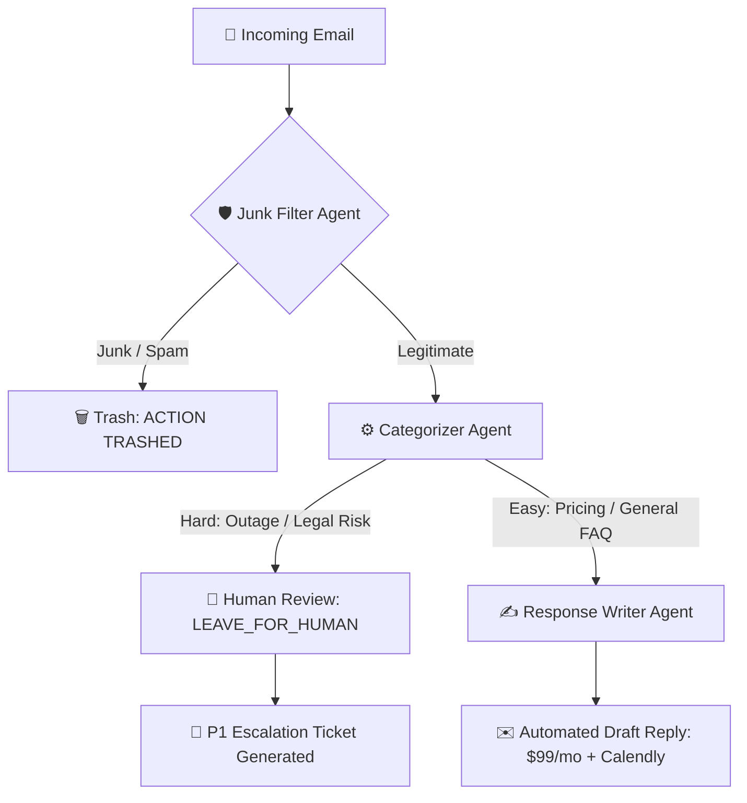

# 🤖 Autonomous Multi-Agent Email Triage & Incident Escalation System

An enterprise-grade, multi-agent AI pipeline built using **CrewAI**, **Google Gemini 2.5 Flash**, and **Python**. This system autonomously ingests, filters, classifies, and responds to incoming enterprise customer emails with deterministic human-in-the-loop escalation guardrails.

---

## 🚀 Key Features & Architectural Highlights

- **Multi-Agent Sequential Orchestration**: Built with CrewAI to pass context seamlessly across specialized worker agents.
- **Spam & Phishing Defense**: Accurately detects and discards phishing attempts without burning triage resources.
- **Context-Aware Triage**: Distinguishes standard commercial inquiries from mission-critical technical emergencies.
- **Human-in-the-Loop Safety Guardrails**: Prevents automated hallucinations during outages/legal disputes by generating structured P1 internal escalation tickets (`STATUS: LEAVE_FOR_HUMAN`).
- **Automated Customer Engagement**: Generates customized onboarding replies with pricing, delivery estimates, and scheduling links for standard inquiries.

---

## 🛠️ Tech Stack

- **Framework**: CrewAI
- **LLM**: Google Gemini (`gemini/gemini-3.5-flash`)
- **Language**: Python 3.11+
- **Environment Management**: `python-dotenv`

---

## 🧠 Multi-Agent Architecture



## 📊 Validated Edge-Case Scenarios

| Scenario | Input Type | Decision / Action | Generated Output |
| :--- | :--- | :--- | :--- |
| **Scenario 1** | Commercial Pricing Inquiry (Rajesh) | `EASY_RESPONSE` | `report_1_easy_response.md` (Professional Draft Reply) |
| **Scenario 2** | Gift Card Phishing Email | `JUNK` | `report_2_junk_trashed.md` (`ACTION: TRASHED`) |
| **Scenario 3** | Live Outage & Legal Action Threat | `HARD_RESPONSE` | `report_3_hard_escalation.md` (`STATUS: LEAVE_FOR_HUMAN` P1 Ticket) |

## ⚙️ How to Run Locally

1. **Clone the Repository:**
```bash
   git clone https://github.com/satyanarayana51115/autonomous-email-triage-agent.git
   cd autonomous-email-triage-agent
```

