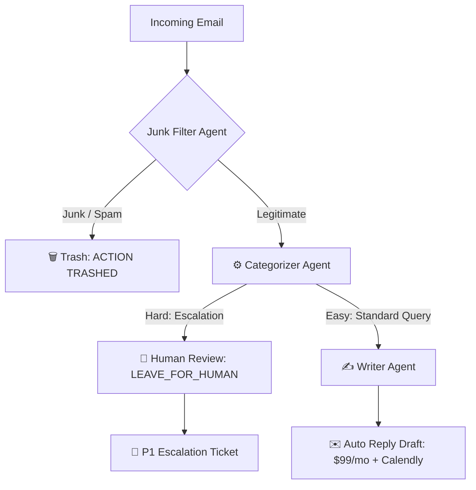

# 🤖 Autonomous Multi-Agent Email Triage & Incident Escalation System

An enterprise-grade, multi-agent AI pipeline built using **CrewAI**, **Google Gemini 2.5 Flash**, and **Python**. This system autonomously ingests, filters, classifies, and responds to incoming enterprise customer emails with deterministic human-in-the-loop escalation guardrails.

---

## 🚀 Key Features & Architectural Highlights

- **Multi-Agent Sequential Orchestration**: Built with CrewAI to pass context seamlessly across specialized worker agents.
- **Spam & Phishing Defense**: Accurately detects and discards phishing attempts without burning triage resources.
- **Context-Aware Triage**: Distinguishes standard commercial inquiries from mission-critical technical emergencies.
- **Human-in-the-Loop Safety Guardrails**: Prevents automated hallucinations during outages/legal disputes by generating structured P1 internal escalation tickets (`STATUS: LEAVE_FOR_HUMAN`).
- **Automated Customer Engagement**: Generates customized onboarding replies with pricing, delivery estimates, and scheduling links for standard inquiries.

---

## 🛠️ Tech Stack

- **Framework**: CrewAI
- **LLM**: Google Gemini (`gemini/gemini-3.5-flash`)
- **Language**: Python 3.11+
- **Environment Management**: `python-dotenv`

---

## 🧠 Multi-Agent Architecture

